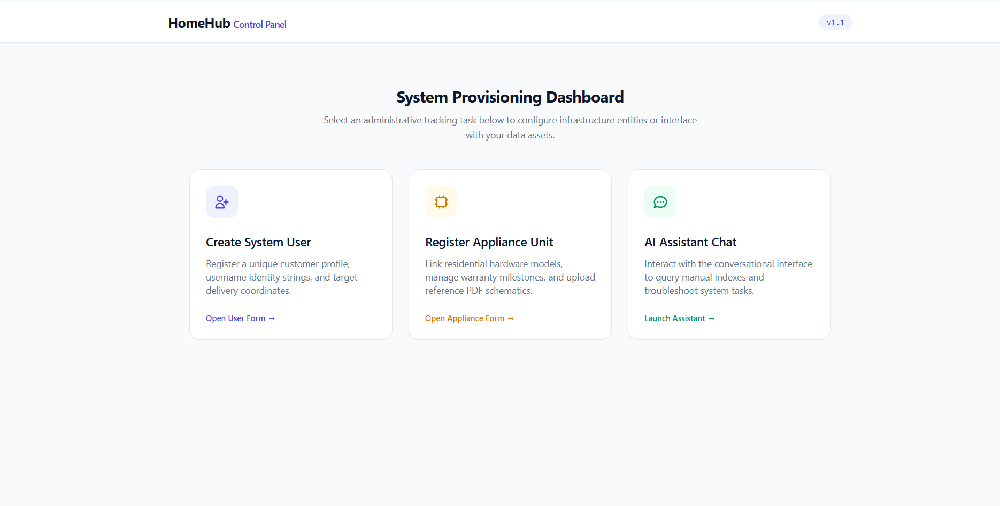
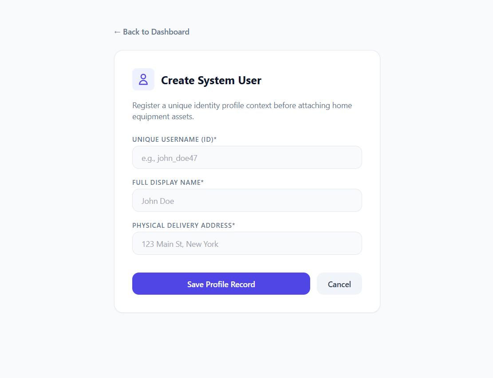
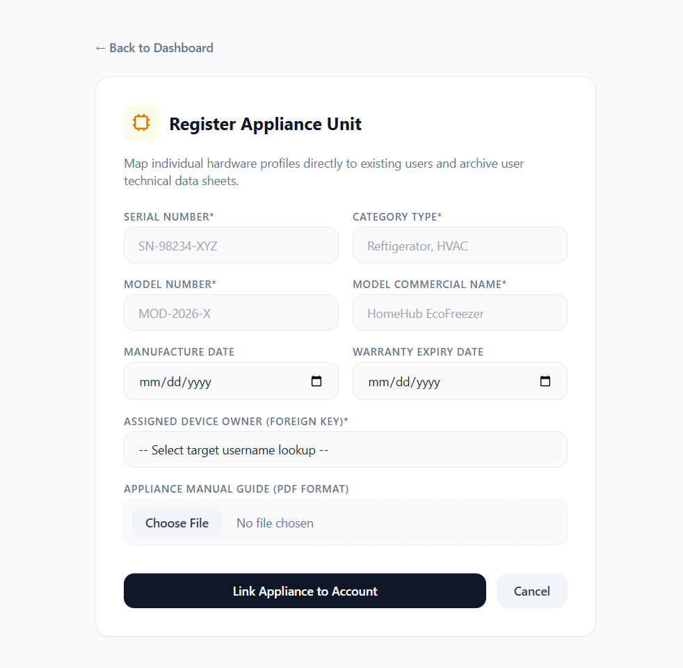
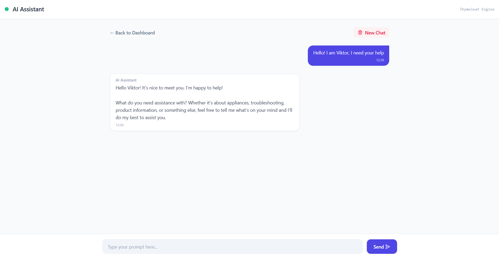

# PoC of Appliance Assistant AI

## 1. Problem Statement & Expected Value

**The Problem:**  
Modern households are full of complex appliances (dishwashers, smart fridges, HVACs). When something errors out, flashes
a code, or breaks, users face two painful bottlenecks: trying to find and read 100-page PDF manuals, or guessing past
maintenance history.

**The Value:**  
Appliance Assistant unifies structured appliance tracking with unstructured technical documentation. It minimizes
appliance downtime, saves money on unnecessary technician visits, and automates home maintenance tracking through a
simple chat interface.

---

## 2. Target User Scenario

A homeowner notices their dishwasher is flashing an obscure code like "Error E15." Instead of Googling it or digging
through a drawer for a paper manual, they open Appliance Assistant and type: "My dishwasher is flashing E15, what should
I do?" The system identifies which model they own from the database, retrieves the exact troubleshooting steps from the
PDF manual via RAG, and provides a safe fix.

---

## 3. Solution Overview

Appliance Assistant is a chatbot that uses a combination of structured appliance data and unstructured technical
documentation to provide users with quick and accurate solutions to their appliance issues. The chatbot uses a
combination of natural language processing and machine learning to understand user queries and provide relevant
solutions. The chatbot also uses a database of appliance models and their troubleshooting steps to provide users with
accurate solutions.

---

## 4. Structure of the Application

### UI – Thymeleaf Framework

### Structured Data

The structured data in Appliance Assistant includes a database of appliance models and their owners.
#### Table of Appliance Models and Owners:
                   users
| username | user_address | user_full_name |
|-----------------|------------|---------------|
| Alex25    | Wrocław, Tragguta,85 | Alex Smith |

             appliance_units
| serial_number | category | model_name | model_number | owner_username | manafacture_date | warranty_expire_date |
|---------------|----------|------------|--------------|----------------|------------------|----------------------|
| DX3456GNf     | Fridge   | Samsung    | SD-45        | Alex25         | 2025-04-05       | 2027-04-05           |

### Unstructured Data

**PDF** - manual guide

The manual guide contains manufacturer-provided troubleshooting instructions, error code explanations, maintenance
procedures, and safety warnings for registered appliances. When users query the chatbot about appliance issues, these
PDF documents are processed and stored as vector embeddings in ChromaDB to enable semantic search through RAG 
(Retrieval-Augmented Generation). This allows the AI to retrieve precise, context-relevant sections from the appropriate
manual based on the user's appliance model and reported problem.

